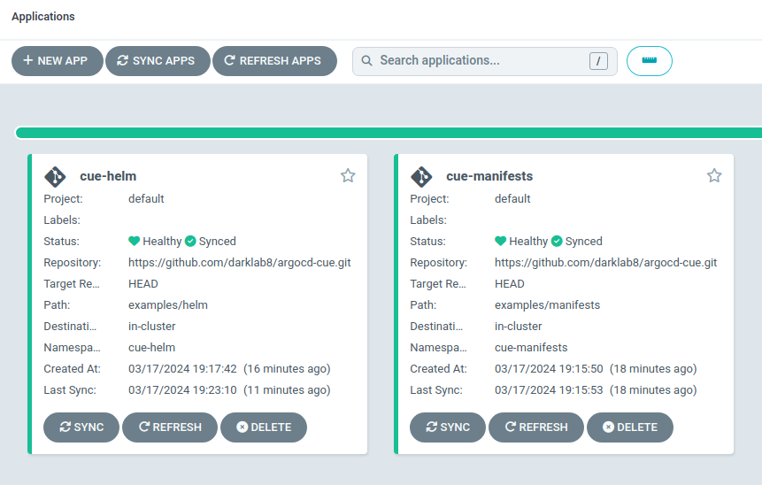

# Argo cd plugin to support Cue language, a.k.a Cuelang

# Examples

- [See folder examples](examples)
- [find more examples in repo infra/k8s/modules](https://github.com/darklab8/infra/tree/master/k8s/modules)

Your can pass extra parameters into argocd application declarations to customize deployments!
- That is necessary to customize `helm template` result with extra args
- [You can find examples here](https://github.com/darklab8/infra/tree/master/k8s/production)

# Features

- you can use this plugin and cue to implement
    - kubernetes manfiests
    - helm charts

- it is in customize format with pinned all dependencies
- using at the moment of this writing:
    - cue 0.7.1 ([See here](plugin/install_deps.sh) for adjustments)
    - helm v3.10.3 ([See here](plugin/install_deps.sh) for adjustments)
    - argocd v2.8.11 (Replace approproate file in [plugin folder](plugin) if necessary)
    - kubectl v1.29.1
    - dependencies are easily adjustable in install_deps.sh
- tested on
  - local [Kind cluster](https://kind.sigs.k8s.io/) for amd64 cpu arch, kind v0.22.0, kube v1.29.2
  - microk8s with arm64 cpu architecture too, microk8s 1.28.7
- inspired by [official guide](https://argo-cd.readthedocs.io/en/stable/operator-manual/config-management-plugins/) and their [helm example plugin](https://github.com/argoproj/argo-cd/tree/master/examples/plugins/helm)

# Getting started with kind cluster

- install
    - [Taskfile](https://taskfile.dev/installation/)
    - [Kind](https://kind.sigs.k8s.io/docs/user/quick-start/)

- run `task cluster:create`
- run `task cluster:scan`
    - get observed ipaddress+port
    - replace cluster address+port in ~/.kube/config for kind cluster with this value

- deploy argo with `task argo:deploy` ( kubectl apply -k ./plugin )
- deploy sample apps `task argo:apply`

# Some docs

- [Cuelang docs](https://cuelang.org/)
- [argocd cue discussion](https://github.com/argoproj/argo-cd/discussions/14472#discussioncomment-8795723)